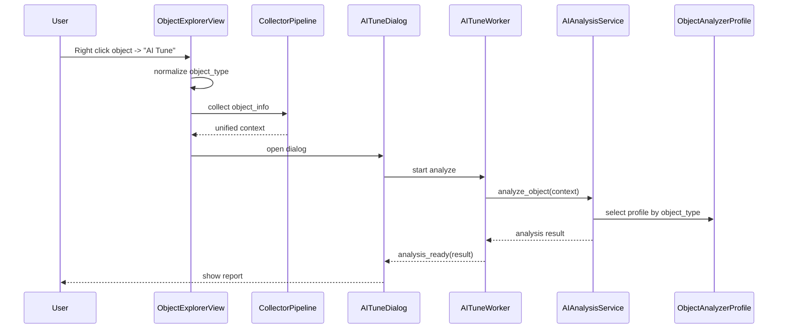

# SQL Performance AI Platform

🚀 **AI-Powered SQL Server Performance Analysis and Optimization Tool**

A professional desktop application for DBA's and developers to analyze SQL Server performance, optimize stored procedures, and get AI-powered recommendations.

## Features

- **AI Chat Interface**: Ask questions about SQL Server performance in natural language
- **Performance Dashboard**: Real-time server metrics and health monitoring
- **SP/Trigger/View Analysis**: Analyze and optimize database objects
- **Index Advisor**: Missing and unused index recommendations
- **Wait Statistics**: Detailed wait analysis and recommendations
- **Security Analysis**: SQL code security scanning
- **Code Comparison**: Side-by-side before/after optimization view

## AI Tune Flow (Object Explorer)

`AI Tune` is object-generic. It supports Stored Procedures, Views, Triggers, and Functions through a type-aware analyzer layer.

High-level runtime flow:

1. `_ai_tune_object` validates selected database object + connection context.
2. `object_type` is normalized once at UI layer and forwarded downstream.
3. `_collect_object_info` runs the collector pipeline and returns a unified `object_info` payload.
4. If pipeline fails, legacy collection fallback is used.
5. `AITuneDialog` starts `AITuneWorker` in a background thread.
6. Worker calls `AIAnalysisService.analyze_object(...)`.
7. Service selects the type profile from `object_analyzers.py`.
8. Service applies validation, index policy gate (when required), optional self-reflection refinement, and cache/audit logic.
9. Final report + confidence payload are returned to dialog.
10. Optional optimization calls `AIAnalysisService.optimize_object(...)` via the same object-type profile system.

### Sequence Diagram



Detailed architecture and decision gates: `ARCHITECTURE.md`

## Technology Stack

| Category | Technology |
|----------|------------|
| Language | Python 3.11+ |
| UI Framework | PyQt6 |
| Code Editor | QScintilla |
| Database | SQLAlchemy + pyodbc |
| AI/LLM | Ollama (local) |
| Config | Pydantic |

## Installation

### Prerequisites

- Python 3.11 or higher
- ODBC Driver for SQL Server (17 or 18)
- Ollama (for AI features)

### Setup

1. Clone the repository:
```bash
git clone https://github.com/yourusername/sql-perf-ai.git
cd sql-perf-ai
```

2. Install dependencies with Poetry:
```bash
pip install poetry
poetry install
```

3. Run the application:
```bash
poetry run python -m app.main
```

Or using the script:
```bash
poetry run sql-perf-ai
```

## Development

### Project Structure

```
sql-perf-ai/
├── app/
│   ├── core/           # Config, constants, exceptions, logger
│   ├── models/         # Data models
│   ├── auth/           # Authentication providers
│   ├── database/       # DB connection and queries
│   ├── analysis/       # SQL parsing, plan analysis
│   ├── ai/             # LLM client, intent detection
│   ├── ui/             # PyQt6 UI components and views
│   └── services/       # Business logic
├── prompts/            # AI prompt templates
├── locales/            # Internationalization
├── assets/             # Icons, fonts, images
├── tests/              # Test suite
└── scripts/            # Build scripts
```

### Running Tests

```bash
poetry run pytest
```

### Code Style

```bash
# Format code
poetry run black app/

# Lint
poetry run ruff app/

# Type check
poetry run mypy app/
```

## Configuration

Settings are stored in:
- Windows: `%LOCALAPPDATA%\SQLPerfAI\config\settings.json`
- macOS: `~/Library/Application Support/SQLPerfAI/config/settings.json`
- Linux: `~/.config/SQLPerfAI/config/settings.json`

### Environment Variables

| Variable | Description | Default |
|----------|-------------|---------|
| `SQLPERFAI_LOGGING__LEVEL` | Log level | INFO |
| `SQLPERFAI_AI__OLLAMA_HOST` | Ollama server URL | http://localhost:11434 |
| `SQLPERFAI_AI__MODEL` | LLM model name | codellama |

## Security

This application **NEVER** accesses user data. It only reads:
- System DMVs (Dynamic Management Views)
- Metadata catalogs (sys.tables, sys.procedures, etc.)
- System databases (master, msdb)

Recommended SQL permissions:
```sql
GRANT VIEW SERVER STATE TO [AppUser];
GRANT VIEW DATABASE STATE TO [AppUser];
GRANT VIEW DEFINITION TO [AppUser];
```

Query Statistics module requirements:
- `VIEW SERVER STATE` is required to load the module.
- `VIEW DEFINITION` (or equivalent `SELECT` access on `sys.sql_modules`) is required for source code tab.
- If `VIEW SERVER STATE` is missing, Query Statistics is disabled with a friendly permission warning.
- If `sys.sql_modules` access is missing, Query Statistics still works but source code view is disabled.
- Sensitive SQL literals are redacted by default in Query Statistics and execution plan views.
- Sending unredacted SQL/plan context to cloud AI providers requires explicit per-session opt-in (local Ollama is exempt).

## License

MIT License - See LICENSE file for details.

## Contributing

Contributions are welcome! Please read CONTRIBUTING.md for guidelines.

---

**Author**: Erdal Cakiroglu  
**Version**: 1.0.0  
**Date**: January 2025
