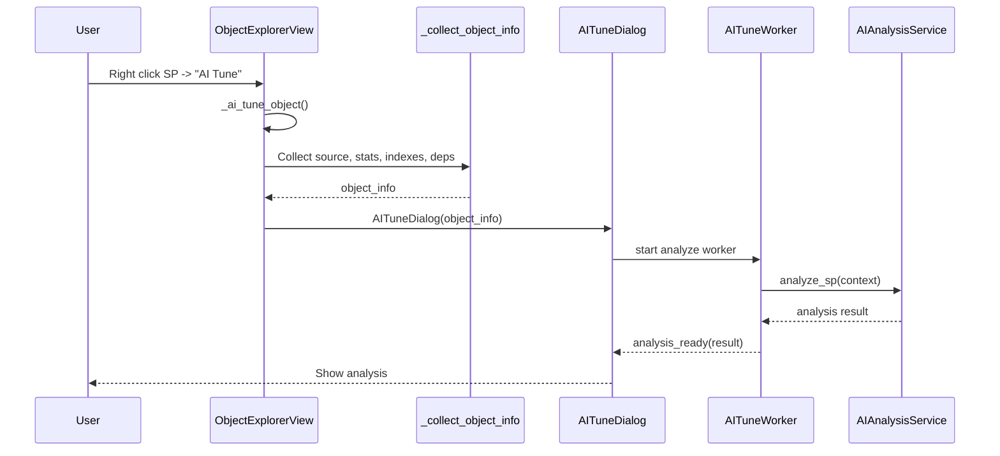

# SQL Performance AI Platform

🚀 **AI-Powered SQL Server Performance Analysis and Optimization Tool**

A professional desktop application for DBA's and developers to analyze SQL Server performance, optimize stored procedures, and get AI-powered recommendations.

## Features

- **AI Chat Interface**: Ask questions about SQL Server performance in natural language
- **Performance Dashboard**: Real-time server metrics and health monitoring
- **SP/Trigger/View Analysis**: Analyze and optimize database objects
- **Index Advisor**: Missing and unused index recommendations
- **Wait Statistics**: Detailed wait analysis and recommendations
- **Security Analysis**: SQL code security scanning
- **Code Comparison**: Side-by-side before/after optimization view

## AI Tune Akisi (Object Explorer)

Object Explorer icinde bir SP icin `AI Tune` calistirildiginda uygulamanin yaptigi isler:

1. Context menu aksiyonu `_ai_tune_object` tetiklenir ve secili obje + DB dogrulanir.
2. `_collect_object_info` ile SP baglam verileri toplanir.
3. `sys.sql_modules` uzerinden source code cekilir.
4. DMV `sys.dm_exec_query_stats` ile execution istatistikleri toplanir.
5. `sys.dm_db_missing_index_*` uzerinden missing index onerileri cekilir.
6. Bagimliliklar (dependencies) bulunur.
7. Query Store aktifse ozet metrikler, waits, top statements ve plan XML denenir.
8. Query Store plan yoksa cached plan XML (DMV) ile fallback yapilir.
9. `AITuneDialog` acilir ve analiz otomatik baslar.
10. `AIAnalysisService.analyze_sp` cagrisi ile AI analizi yapilir.
11. Hata olursa fallback rapor uretilir.
12. Opsiyonel: `Kod Optimize Et` butonu ile `optimize_sp` cagrilir.

### Sequence Diagram



## Technology Stack

| Category | Technology |
|----------|------------|
| Language | Python 3.11+ |
| UI Framework | PyQt6 |
| Code Editor | QScintilla |
| Database | SQLAlchemy + pyodbc |
| AI/LLM | Ollama (local) |
| Config | Pydantic |

## Installation

### Prerequisites

- Python 3.11 or higher
- ODBC Driver for SQL Server (17 or 18)
- Ollama (for AI features)

### Setup

1. Clone the repository:
```bash
git clone https://github.com/yourusername/sql-perf-ai.git
cd sql-perf-ai
```

2. Install dependencies with Poetry:
```bash
pip install poetry
poetry install
```

3. Run the application:
```bash
poetry run python -m app.main
```

Or using the script:
```bash
poetry run sql-perf-ai
```

## Development

### Project Structure

```
sql-perf-ai/
├── app/
│   ├── core/           # Config, constants, exceptions, logger
│   ├── models/         # Data models
│   ├── auth/           # Authentication providers
│   ├── database/       # DB connection and queries
│   ├── analysis/       # SQL parsing, plan analysis
│   ├── ai/             # LLM client, intent detection
│   ├── ui/             # PyQt6 UI components and views
│   └── services/       # Business logic
├── prompts/            # AI prompt templates
├── locales/            # Internationalization
├── assets/             # Icons, fonts, images
├── tests/              # Test suite
└── scripts/            # Build scripts
```

### Running Tests

```bash
poetry run pytest
```

### Code Style

```bash
# Format code
poetry run black app/

# Lint
poetry run ruff app/

# Type check
poetry run mypy app/
```

## Configuration

Settings are stored in:
- Windows: `%LOCALAPPDATA%\SQLPerfAI\config\settings.json`
- macOS: `~/Library/Application Support/SQLPerfAI/config/settings.json`
- Linux: `~/.config/SQLPerfAI/config/settings.json`

### Environment Variables

| Variable | Description | Default |
|----------|-------------|---------|
| `SQLPERFAI_LOGGING__LEVEL` | Log level | INFO |
| `SQLPERFAI_AI__OLLAMA_HOST` | Ollama server URL | http://localhost:11434 |
| `SQLPERFAI_AI__MODEL` | LLM model name | codellama |

## Security

This application **NEVER** accesses user data. It only reads:
- System DMVs (Dynamic Management Views)
- Metadata catalogs (sys.tables, sys.procedures, etc.)
- System databases (master, msdb)

Recommended SQL permissions:
```sql
GRANT VIEW SERVER STATE TO [AppUser];
GRANT VIEW DATABASE STATE TO [AppUser];
GRANT VIEW DEFINITION TO [AppUser];
```

## License

MIT License - See LICENSE file for details.

## Contributing

Contributions are welcome! Please read CONTRIBUTING.md for guidelines.

---

**Author**: Erdal Cakiroglu  
**Version**: 1.0.0  
**Date**: January 2025
